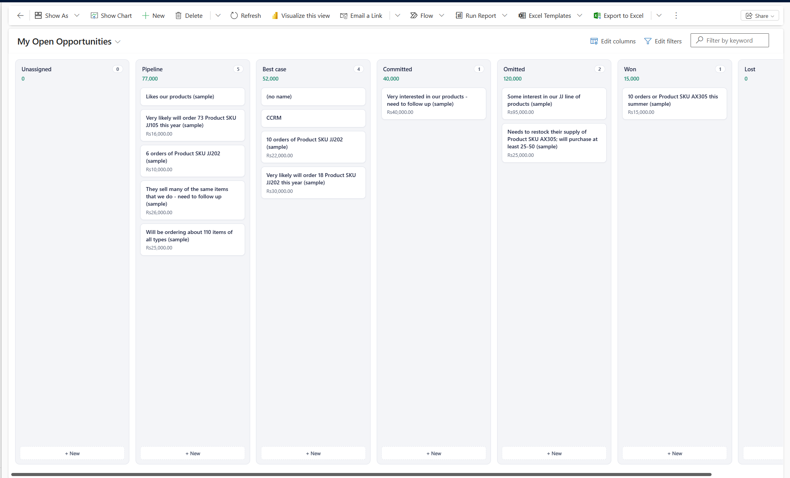

# Pipeline Kanban

A Power Apps component framework (PCF) dataset control for Dynamics 365 / Dataverse — a real drag-and-drop Kanban board for any view, grouped by any Choice (Option Set) column. Built because Dynamics has no native way to visualize and move records between pipeline stages by dragging cards.



## What it does

- **Drag-and-drop columns** built live from a Choice field's real configured options — add a new option in Dataverse, a new column appears automatically, no control changes needed
- **Per-column totals** — sums any currency/number field you configure (e.g. Estimated Revenue) so you can see pipeline value by stage at a glance
- **Works on any table, any Choice field** — nothing in the control is hardcoded to Opportunity. Point it at Leads grouped by Rating, Cases grouped by Priority, or a custom pipeline stage field — it's all driven by two configurable properties
- **"+ New" per column** creates a record and correctly sets it to that column's value — not whatever the form's own default happens to be
- **Click a card** to open the real underlying record
- **Drag to Unassigned** to clear a record's value, with a confirmation prompt first

## Installation

### Option A — Install the packaged solution (recommended)

1. Download the latest managed solution `.zip` from this repo's [Releases](../../releases) page
2. In [make.powerapps.com](https://make.powerapps.com), **Solutions → Import solution**, select the zip
3. Open the **view** you want this on (e.g. an Opportunity view) → **Components** → add **Pipeline Kanban**
4. Set the two properties:
   - `groupByField` — the logical name of the Choice column to group by (e.g. `msdyn_forecastcategory`)
   - `valueField` — optional, the logical name of a currency/number column to total per column (e.g. `estimatedvalue`)
5. Save and publish

Full step-by-step with screenshots: see [DEPLOYMENT.md](DEPLOYMENT.md).

### Option B — Build from source

The `PipelineKanban/` folder in this repo is ready to drop into a project scaffolded with:

```
pac pcf init --namespace YourNamespace --name PipelineKanban --template dataset --run-npm-install
```

Note the `--template dataset` — this is a dataset-type control (bound to a view), not a field-type control.

## Why a Choice field, not the Business Process Flow stage?

Dynamics' "official" pipeline stage usually lives inside a Business Process Flow (BPF), not as a plain field — and BPF stage transitions involve a separate process-tracking mechanism (`stageid`, `traversedpath`) plus per-stage required-field validation that isn't reachable from a dataset-bound control the way it is from an open record's form. This control instead groups by **any Choice column you configure** — e.g. a plain "Pipeline Stage" field, or a built-in one like Forecast Category — which is simple, safe, and fully under your control. If your organization needs BPF-stage-aware dragging with validation, that's a meaningfully larger, riskier build and isn't what this control does today.

## Known limitations

- **Choice fields only** — no Business Process Flow stage support in this version
- **Dataset page size applies** — very large views may not show every record without additional paging handling
- **No multi-select drag** — one card at a time
- **"+ New" can't pre-select a column's exact Choice value on the create form itself** — it opens the standard quick-create, then sets the field after saving, so there's a brief moment where the form shows its own default before the correct value is applied

## License

MIT — see [LICENSE](LICENSE).
